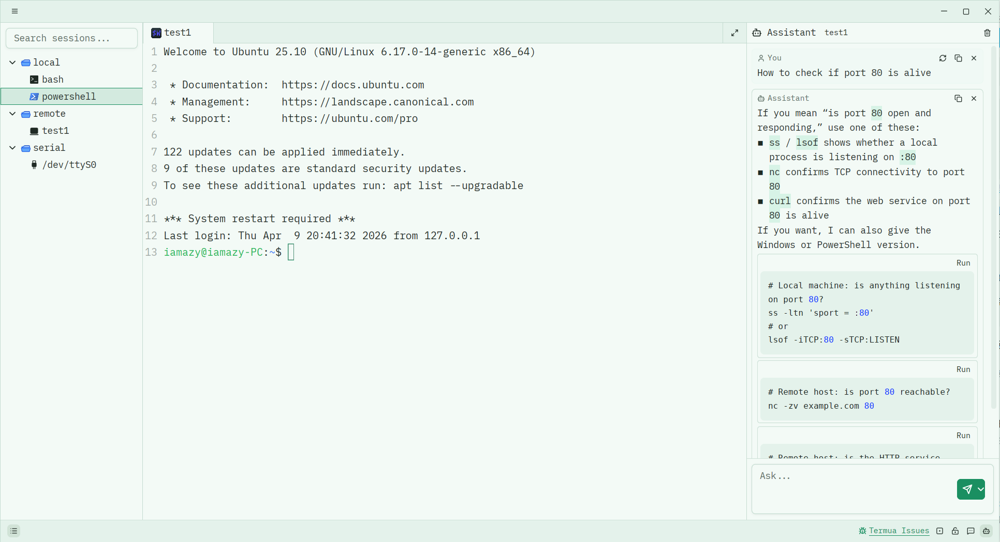

<p align="center">
  <a href="./README.md">English</a> | 简体中文
</p>

<p align="center">
  
</p>

<p align="center">
  <span style="font: bold; font-size: larger">Termua:</span> 一款使用 <a href="https://github.com/zed-industries/zed">GPUI</a> 构建，基于 <a href="https://github.com/alacritty/alacritty">Alacritty</a>  / <a href="https://github.com/wezterm/wezterm">Wezterm</a>  内核的开源跨平台终端应用。
</p>

<p align="center">
  集成 SSH / Serial / SFTP / 回放 / 终端共享 / AI 助手，目标是成为一个现代化的终端工作台。
</p>

<p>
    <div align="center">
      <a href="https://github.com/iamazy/termua/releases">
        
      </a>
      <a href="https://github.com/iamazy/termua/releases">
        
      </a>
      <a href="https://github.com/iamazy/termua/releases">
        
      </a>
    </div>
</p>

<div align="center">
    
</div>

### 特性 ❇️

- [x] 跨平台：Linux / macOS / Windows
- [x] 终端内核：支持 Alacritty / WezTerm 后端
- [x] SSH：基于 `wezterm-ssh`，支持 Password / SSH Config 登录
- [x] 串口：支持串口会话、波特率 / 校验位 / 流控配置
- [x] SFTP 文件操作：支持文件（拖拽）上传、并发控制等
- [x] 终端共享：通过 relay 分享终端会话
- [x] Cast 录制回放：录制与回放终端操作
- [x] 批量支持：多终端批量执行
- [x] AI 助手：内置 ZeroClaw Assistant
- [x] 多主题：支持主题切换、通过主题编辑器新增或编辑主题
- [x] 锁屏：应用锁屏与超时自动锁定
- [x] 静态提示：基于预配置的静态命令提示，支持通配符

### 路线 🏁

- [ ] 支持 Lua 脚本，支持更多场景的可定制化
- [ ] 支持工作流
- [ ] ...

### 快速上手

#### 回放 cast

除了图形界面里的录制 / 回放能力，Termua 也支持命令行直接播放 cast：

```bash
termua --play-cast demo.cast
termua --play-cast demo.cast --speed 2
```

#### 终端会话共享

除了可以使用 `termua-relay` 启动 relay 进程，也可以在 Termua 配置页中启动本地 relay 进程用于测试

```bash
termua-relay --listen 127.0.0.1:7231
```

观看侧在会话共享期间可以申请操作终端，共享侧也支持回收操作权限。


### 配置

#### `settings.json` 示例

```json
{
  "appearance": {
    "theme": "system",
    "language": "zh-CN"
  },
  "terminal": {
    "default_backend": "alacritty",
    "ssh_backend": "ssh2",
    "font_family": ".ZedMono",
    "font_size": 15,
    "ligatures": true,
    "cursor_shape": "block",
    "blinking": "on",
    "option_as_meta": false,
    "show_scrollbar": true,
    "show_line_numbers": true,
    "copy_on_select": true,
    "suggestions_enabled": false,
    "suggestions_max_items": 8,
    "sftp_upload_max_concurrency": 5
  },
  "sharing": {
    "enabled": false,
    "relay_url": "ws://127.0.0.1:7231/ws"
  },
  "recording": {
    "include_input_by_default": false,
    "playback_speed": 1.0
  },
  "logging": {
    "level": "default",
    "path": "termua.log"
  }
}
```

不建议直接修改 `settings.json` 文件，建议通过 `Termua` 的配置页进行修改。

### 发布 🦀

你可以在 [artifacts 页](https://github.com/iamazy/nxshell/actions) 下载二进制产物。

### 致谢 ❤️

- [GPUI](https://github.com/zed-industries/zed): GPUI is a hybrid immediate and retained mode, GPU accelerated, UI framework for Rust, designed to support a wide variety of applications.
- [gpui-component](https://github.com/longbridge/gpui-component): Rust GUI components for building fantastic cross-platform desktop application by using GPUI.
- [Alacritty](https://github.com/alacritty/alacritty): A cross-platform, OpenGL terminal emulator.
- [Wezterm](https://github.com/wezterm/wezterm): A GPU-accelerated cross-platform terminal emulator and
  multiplexer and implemented in Rust

### License 🚨

<a href="./LICENSE-AGPL"></a>
